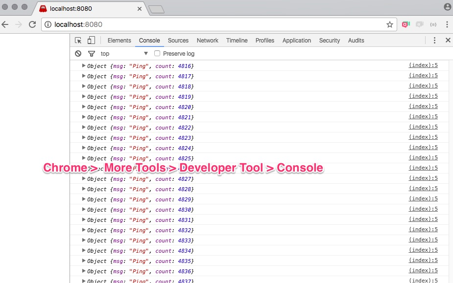

# Ứng dụng đơn giản Socket.io

## Chạy thử ứng dụng đơn giản nhất

Gõ URL http://localhost:8080, sau đó mở Developer Tool > Console ra coi
```bash
node simple.js
```

## Ứng dụng ping pong
```bash
node ping.js
```
Mở trình duyệt vào địa chỉ http://localhost:8080
Sau đó chuột phải để mở Developer Tool, ấn vào Console


Ứng dụng client có cả phiên bản iOS Swift
vào thư mục SwiftChat gõ lệnh ```pod install```
Sau đó biên dịch chạy

## Ứng dụng chat

```bash
node chat.js
```